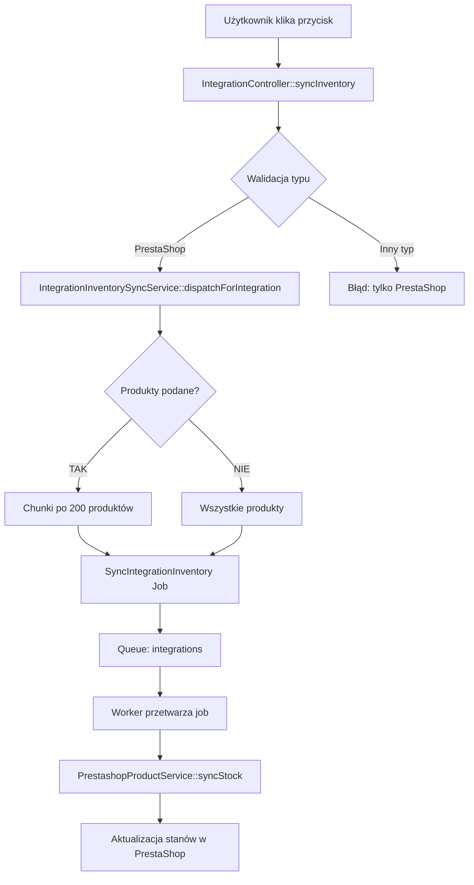

# Ręczna Synchronizacja Stanów Magazynowych z PrestaShop

## 📋 Przegląd

Dodano możliwość ręcznego uruchamiania synchronizacji stanów magazynowych dla integracji PrestaShop poprzez dedykowany przycisk w panelu administracyjnym.

## 🎯 Funkcjonalność

### Automatyczna Synchronizacja

System automatycznie synchronizuje stany magazynowe z PrestaShop w następujących przypadkach:

1. **Po zatwierdzeniu dokumentu magazynowego** (PZ, WZ, IN, OUT)
   - `WarehouseDocumentService::post()` → wywołuje `IntegrationInventorySyncService`
   
2. **Po anulowaniu dokumentu magazynowego**
   - `WarehouseDocumentService::cancel()` → wywołuje `IntegrationInventorySyncService`
   
3. **Po zatwierdzeniu inwentaryzacji** ✨ NOWE
   - `InventoryCountService::approve()` → wywołuje `IntegrationInventorySyncService`

### Ręczna Synchronizacja

Dodano przycisk **"Synchronizuj stany"** w panelu edycji integracji PrestaShop, który umożliwia:

- Natychmiastowe uruchomienie synchronizacji wszystkich stanów magazynowych
- Synchronizację konkretnych produktów (gdy podane `product_ids`)
- Działanie w tle przez system kolejek (queue: `integrations`)

## 🛠️ Implementacja

### Backend

#### 1. Kontroler: `IntegrationController::syncInventory()`

```php
// app/Http/Controllers/Admin/IntegrationController.php

public function syncInventory(Request $request, Integration $integration): RedirectResponse
{
    if ($integration->type !== IntegrationType::PRESTASHOP) {
        return back()->with('error', 'Synchronizacja stanów magazynowych jest dostępna tylko dla integracji PrestaShop.');
    }

    $this->authorize('update', $integration);

    $productIds = $request->input('product_ids', []);
    
    app(\App\Services\Integrations\IntegrationInventorySyncService::class)
        ->dispatchForIntegration($integration, $productIds);

    $message = empty($productIds) 
        ? 'Synchronizacja wszystkich stanów magazynowych została uruchomiona w tle.'
        : 'Synchronizacja stanów magazynowych dla ' . count($productIds) . ' produktów została uruchomiona w tle.';

    return back()->with('success', $message);
}
```

#### 2. Routing

```php
// routes/web.php

Route::post('/integrations/{integration}/sync-inventory', [IntegrationController::class, 'syncInventory'])
    ->name('integrations.sync-inventory');
```

#### 3. Naprawa: Synchronizacja po Zatwierdzeniu Inwentaryzacji

**Problem:** Po zatwierdzeniu inwentaryzacji dokumenty korygujące (IN/OUT) były tworzone, ale synchronizacja z PrestaShop się nie uruchamiała.

**Rozwiązanie:**

```php
// app/Services/Warehouse/InventoryCountService.php

public function approve(InventoryCount $inventoryCount, User $approver): InventoryCount
{
    // ... existing code ...

    $approvedInventory = $this->db->transaction(function () use ($inventoryCount, $approver) {
        $this->createAdjustmentDocuments($inventoryCount);
        
        $inventoryCount->update([
            'status' => InventoryCountStatus::APPROVED,
            'approved_by' => $approver->id,
        ]);

        return $inventoryCount->fresh();
    });

    // ✨ DODANO: Synchronizacja z integracjami
    $affectedProductIds = $approvedInventory->items->pluck('product_id')->unique()->values()->all();
    
    app(\App\Services\Integrations\IntegrationInventorySyncService::class)
        ->dispatchForUser($approvedInventory->user, $affectedProductIds);

    return $approvedInventory;
}
```

### Frontend

#### 1. Komponent: `IntegrationSummaryCard`

Dodano przycisk synchronizacji dla integracji PrestaShop:

```jsx
// resources/js/Pages/Integrations/Edit.jsx

function IntegrationSummaryCard({ integration, onTest, onDelete, onSyncInventory, testing, deleting, syncing }) {
    return (
        <Card>
            {/* ... existing content ... */}
            <CardFooter className="flex flex-wrap items-center justify-end gap-3">
                {integration.type === 'prestashop' && onSyncInventory && (
                    <Button
                        variant="outline"
                        size="sm"
                        onClick={onSyncInventory}
                        disabled={syncing}
                    >
                        <PackageCheck className={`mr-2 size-4 ${syncing ? 'animate-pulse' : ''}`} />
                        {syncing ? 'Synchronizuję...' : 'Synchronizuj stany'}
                    </Button>
                )}
                {/* ... other buttons ... */}
            </CardFooter>
        </Card>
    );
}
```

#### 2. Handler w głównym komponencie

```jsx
function IntegrationsEdit() {
    const [syncing, setSyncing] = useState(false);

    const handleSyncInventory = () => {
        setSyncing(true);
        router.post(
            `/integrations/${integration.id}/sync-inventory`,
            {},
            {
                preserveScroll: true,
                onFinish: () => setSyncing(false),
            },
        );
    };

    return (
        <IntegrationSummaryCard
            integration={integration}
            onSyncInventory={integration.type === 'prestashop' ? handleSyncInventory : undefined}
            syncing={syncing}
            // ...
        />
    );
}
```

## 📝 Użycie

### Przez Panel Administracyjny

1. Przejdź do **Integracje** → wybierz integrację PrestaShop
2. W karcie podsumowania kliknij przycisk **"Synchronizuj stany"**
3. System doda job do kolejki i wyświetli komunikat potwierdzający
4. Job wykona się w tle (upewnij się, że działa `queue:work`)

### Przez Artisan (CLI)

```bash
# Ręczna synchronizacja przez komendę
php artisan integrations:sync-inventory

# Uruchomienie queue workera do przetwarzania jobów
php artisan queue:work --queue=integrations
```

### Przez API/Tinker

```php
$integration = Integration::find(1); // Twoja integracja PrestaShop
$productIds = [123, 456, 789]; // Opcjonalnie: konkretne produkty

app(\App\Services\Integrations\IntegrationInventorySyncService::class)
    ->dispatchForIntegration($integration, $productIds);
```

## 🔧 Konfiguracja

### Tryby Synchronizacji

W konfiguracji integracji PrestaShop można ustawić:

- `inventory_sync_mode`:
  - `local_to_presta` - synchronizacja stanów z lokalnego magazynu do PrestaShop ✅
  - `prestashop_to_local` - synchronizacja z PrestaShop do lokalnego magazynu (metadata)
  - `disabled` - synchronizacja wyłączona

### Parametry Synchronizacji

- `primary_warehouse_id` - główny magazyn dla synchronizacji (wymagany dla `local_to_presta`)
- Interwał automatycznej synchronizacji (domyślnie: co 5 minut)

## 🚀 Przepływ Danych



## ⚡️ Queue & Jobs

### Job: `SyncIntegrationInventory`

- **Queue:** `integrations`
- **Timeout:** 3600 sekund (1 godzina) - dla długich synchronizacji
- **Opcje:** `afterCommit()` - uruchomienie po zacommitowaniu transakcji
- **Chunking produktów:** 
  - Małe synchronizacje (< 1000 produktów): jeden job
  - Duże synchronizacje (≥ 1000 produktów): automatyczny podział na joby po 500 produktów
- **Batch processing:** Wykorzystuje concurrent requests (10 równocześnie) dla optymalizacji

### Strategia Synchronizacji

#### Dla Małych Zmian (< 1000 produktów)
- **Przykład:** Zatwierdzenie dokumentu PZ z 50 produktami
- **Działanie:** 1 job synchronizuje wszystkie produkty
- **Czas:** ~10-30 sekund

#### Dla Dużych Synchronizacji (≥ 1000 produktów)
- **Przykład:** Inwentaryzacja, przycisk "Synchronizuj wszystko"
- **Działanie:** Automatyczny podział na joby po 500 produktów każdy
- **Przykład:** 17,800 produktów = 36 jobów po ~500 produktów
- **Czas na job:** ~5-8 minut
- **Łączny czas:** ~3-5 godzin (joby działają równolegle gdy jest wielu workerów)

### Optymalizacja Wydajności

```php
// Dla > 1000 produktów: automatyczny podział
$totalProducts = 17800;
$chunkSize = 500;
$jobCount = ceil($totalProducts / $chunkSize); // 36 jobów

// Każdy job:
// - Synchronizuje 500 produktów
// - Używa batch update (10 concurrent requests)
// - Trwa ~5-8 minut
```

### Uruchamianie Queue Workera

```bash
# W Dockerze (recommended)
docker compose exec laravel.test php artisan queue:work --queue=integrations

# Lokalnie
php artisan queue:work --queue=integrations

# Z supervisord (produkcja)
# Zobacz: docs/DOCKER_QUEUE_WORKERS.md
```

## 📊 Monitoring

### Sprawdzenie Failed Jobs

```bash
php artisan queue:failed
```

### Ponowne uruchomienie nieudanego joba

```bash
php artisan queue:retry <job-id>
```

### Czyszczenie failed jobs

```bash
php artisan queue:flush
```

## 🔍 Debugging

### Logi

Sprawdź logi w:
- `storage/logs/laravel.log`
- Logi dockera: `docker compose logs -f laravel.test`

### Test Synchronizacji

```php
// Przez Tinker
php artisan tinker

$integration = Integration::find(1);
app(\App\Services\Integrations\IntegrationInventorySyncService::class)
    ->dispatchForIntegration($integration);
```

## ✅ Testy

### Przypadki Testowe

1. ✅ **Synchronizacja po zatwierdzeniu PZ** - automatyczna
2. ✅ **Synchronizacja po zatwierdzeniu inwentaryzacji** - automatyczna
3. ✅ **Ręczna synchronizacja przez przycisk** - manualna
4. ✅ **Synchronizacja wybranych produktów** - przez API
5. ✅ **Walidacja typu integracji** - tylko PrestaShop
6. ✅ **Authorization check** - użytkownik musi mieć uprawnienia do edycji integracji

## 🐛 Known Issues & Solutions

### Problem: Job timeout przy dużej liczbie produktów

**Objaw:** Worker jest killowany po ~1 minucie dla dużych synchronizacji

**Przyczyna:** Domyślny timeout workera (60 sekund) jest za krótki

**Rozwiązanie:** ✅ Zaimplementowane
- Job ma `$timeout = 3600` (1 godzina)
- Duże synchronizacje (> 1000 produktów) są automatycznie dzielone na mniejsze joby po 500 produktów
- Worker uruchamiać z: `php artisan queue:work --timeout=3600 --queue=integrations`

### Problem: PrestaShop API rate limiting

**Objaw:** Niektóre requesty zwracają błąd 429 (Too Many Requests)

**Rozwiązanie:** ✅ Zaimplementowane
- Batch sync używa concurrent requests (max 10 równocześnie)
- Delay 200ms między chunkami
- Automatyczne retry (3 próby z 60s backoff)

## 📚 Powiązane Dokumenty

- [Synchronizacja Inwentaryzacji](INVENTORY_SYNC.md)
- [Komendy Queue](QUEUE_COMMANDS.md)
- [Docker Queue Workers](DOCKER_QUEUE_WORKERS.md)

## 🎉 Changelog

### 2025-11-06
- ✨ Dodano przycisk "Synchronizuj stany" w panelu integracji PrestaShop
- 🐛 Naprawiono brak synchronizacji po zatwierdzeniu inwentaryzacji
- ⚡️ Zoptymalizowano synchronizację dużych ilości produktów (chunking po 500)
- ⚡️ Zwiększono timeout joba do 1 godziny
- ⚡️ Dodano automatyczny podział dużych synchronizacji na mniejsze joby
- 📝 Dodano dokumentację

---

**Autor:** System  
**Data:** 6 listopada 2025  
**Wersja:** 1.0.0
