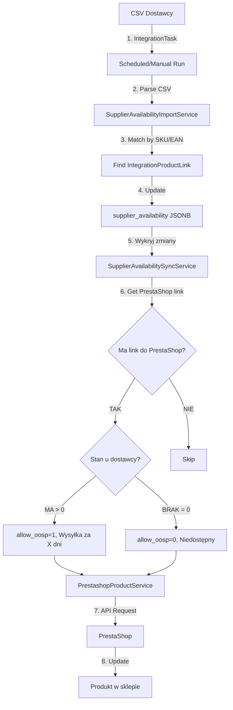

# 📦 Plan Implementacji: Dostępność Produktów u Dostawcy

## 🎯 Cel Funkcjonalności

Automatyczna synchronizacja dostępności produktów u dostawców z PrestaShop, aby:
1. **Import CSV** - pobieranie stanów magazynowych dostawców
2. **Synchronizacja PrestaShop** - ustawienie:
   - Czy można zamawiać gdy brak na stanie (allow backorders)
   - Etykieta gdy brak na stanie (label when out of stock)
3. **Automatyzacja** - codzienne aktualizacje (minimum 1x dziennie)

## 📋 Wymagania Biznesowe

### Logika Biznesowa:

```
JEŚLI dostawca MA produkt NA STANIE:
  ✅ allow_oosp = 1 (można zamawiać gdy brak)
  📦 available_later = "Wysyłka za 3 dni"
  
JEŚLI dostawca NIE MA produktu:
  ❌ allow_oosp = 0 (NIE można zamawiać)
  📭 available_later = "Produkt niedostępny"
```

### Pola PrestaShop:
- `out_of_stock` / `allow_oosp` - (0 = deny, 1 = allow, 2 = default)
- `available_later` - label when out of stock (multilang)

## 🗄️ Struktura Bazy Danych

### ✅ Wykorzystanie Istniejącej Struktury

Twój system już ma:
- ✅ `contractors` z polem `is_supplier` - dostawcy
- ✅ `integrations` + `integration_tasks` - import CSV/XML
- ✅ `integration_product_links` - linkowanie produktów

**Zalecenie:** Dodaj pole do `integration_product_links` zamiast tworzyć nową tabelę!

### 1. Rozszerzenie `integration_product_links` (NAJPROSTSZE)

```sql
-- Dodaj kolumnę do przechowywania dostępności u dostawcy
ALTER TABLE integration_product_links 
ADD COLUMN supplier_availability JSONB;

-- Struktura JSONB:
{
  "is_available": true,
  "stock_quantity": 150,
  "delivery_days": 3,
  "last_checked_at": "2025-11-07T10:00:00Z",
  "last_status_change_at": "2025-11-06T08:30:00Z",
  "contractor_id": 5  // ID dostawcy z tabeli contractors
}

-- Index dla szybkich query
CREATE INDEX idx_integration_links_availability 
ON integration_product_links USING GIN (supplier_availability);
```

**Dlaczego to rozwiązanie?**
- ✅ Wykorzystuje istniejącą strukturę `integration_product_links`
- ✅ Nie trzeba tworzyć nowej tabeli
- ✅ Dane o dostępności są tam gdzie produkty są już zlinkowane
- ✅ Prostsza synchronizacja (jeden rekord = produkt + link + dostępność)

### 2. Opcjonalne: Dodanie contractor_id do Products (jeśli nie ma)

Sprawdź czy `products` mają przypisanego dostawcę:

```sql
-- Jeśli nie ma, dodaj:
ALTER TABLE products 
ADD COLUMN contractor_id BIGINT REFERENCES contractors(id) ON DELETE SET NULL;

CREATE INDEX idx_products_contractor ON products(contractor_id);
```

To pozwoli szybko znaleźć produkty danego dostawcy.

## 🏗️ Architektura Systemu

### ✅ Wykorzystanie Istniejącego Systemu

Twój obecny system ma:
```
Integration (CSV-XML-Import)
  ↓ has many
IntegrationTask (resource_type: 'products')
  ↓ stores
  - mappings (JSON)
  - source_location (URL/path)
  - delimiter, has_header
  - fetch_mode (manual, daily, cron)
  ↓ creates
IntegrationProductLinks
  ↓ now with
  - supplier_availability (JSONB) ← NOWE POLE
```

### 1. Modele - Rozszerzenia

```
app/Models/
├── IntegrationProductLink.php        [MODIFY - dodać metody dla availability]
├── Integration.php                   [OK - bez zmian]
├── IntegrationTask.php                [MODIFY - dodać resource_type: 'supplier-availability']
├── Contractor.php                     [OK - już ma is_supplier]
└── Product.php                        [MODIFY - relacja do contractor]
```

### 2. Services - Nowe

```
app/Services/Integrations/
├── SupplierAvailabilityImportService.php      [NEW] - Import CSV z dostępnością
├── SupplierAvailabilitySyncService.php        [NEW] - Sync z PrestaShop
└── PrestashopProductService.php               [MODIFY] - Dodać updateAvailability()
```

### 3. Jobs - Nowe

```
app/Jobs/
├── ImportSupplierAvailability.php             [NEW] - Rozszerzenie obecnego importu
└── SyncSupplierAvailabilityToPrestashop.php   [NEW] - Sync do PrestaShop
```

### 4. Resource Type dla IntegrationTask

Dodaj nowy typ zasobu:

```php
// IntegrationTask może mieć:
resource_type = 'products'                  // Obecny (import produktów)
resource_type = 'supplier-availability'     // NOWY (import dostępności)
```

Dzięki temu jeden CSV może importować:
1. **Produkty** (jeśli nowe) - resource_type: 'products'
2. **Dostępność** (aktualizacja stanów) - resource_type: 'supplier-availability'

## 📊 Przepływ Danych



## 💻 Implementacja Krok po Kroku

### KROK 1: Migracja - Dodanie Pola do integration_product_links

```bash
php artisan make:migration add_supplier_availability_to_integration_product_links
```

```php
// database/migrations/YYYY_MM_DD_add_supplier_availability_to_integration_product_links.php

public function up(): void
{
    Schema::table('integration_product_links', function (Blueprint $table) {
        $table->jsonb('supplier_availability')->nullable()->after('metadata');
        $table->index('supplier_availability', 'idx_supplier_availability', 'GIN');
    });
}

public function down(): void
{
    Schema::table('integration_product_links', function (Blueprint $table) {
        $table->dropIndex('idx_supplier_availability');
        $table->dropColumn('supplier_availability');
    });
}
```

### KROK 2: Rozszerzenie Modelu IntegrationProductLink

```php
// app/Models/IntegrationProductLink.php

class IntegrationProductLink extends Model
{
    protected $fillable = [
        // ... existing
        'supplier_availability',
    ];

    protected $casts = [
        // ... existing
        'supplier_availability' => 'array',
    ];
    
    /**
     * Check if supplier has product available
     */
    public function isAvailableAtSupplier(): bool
    {
        return ($this->supplier_availability['is_available'] ?? false) === true;
    }
    
    /**
     * Get stock quantity at supplier
     */
    public function getSupplierStockQuantity(): int
    {
        return (int) ($this->supplier_availability['stock_quantity'] ?? 0);
    }
    
    /**
     * Get delivery days from supplier
     */
    public function getSupplierDeliveryDays(): int
    {
        return (int) ($this->supplier_availability['delivery_days'] ?? 3);
    }
    
    /**
     * Update supplier availability
     */
    public function updateSupplierAvailability(
        bool $isAvailable,
        int $stockQuantity,
        int $deliveryDays = 3,
        ?int $contractorId = null
    ): void {
        $old = $this->supplier_availability ?? [];
        $statusChanged = ($old['is_available'] ?? null) !== $isAvailable;
        
        $this->supplier_availability = [
            'is_available' => $isAvailable,
            'stock_quantity' => $stockQuantity,
            'delivery_days' => $deliveryDays,
            'contractor_id' => $contractorId,
            'last_checked_at' => now()->toIso8601String(),
            'last_status_change_at' => $statusChanged 
                ? now()->toIso8601String() 
                : ($old['last_status_change_at'] ?? now()->toIso8601String()),
        ];
        
        $this->save();
    }
    
    /**
     * Get PrestaShop out_of_stock value (0 = deny, 1 = allow, 2 = default)
     */
    public function getPrestashopOutOfStockValue(): int
    {
        return $this->isAvailableAtSupplier() ? 1 : 0;
    }
    
    /**
     * Get PrestaShop available_later label
     */
    public function getPrestashopAvailableLater(): string
    {
        if ($this->isAvailableAtSupplier()) {
            $days = $this->getSupplierDeliveryDays();
            return $days > 0 
                ? "Wysyłka za {$days} dni" 
                : "Dostępny u dostawcy";
        }
        
        return "Produkt niedostępny";
    }
}
```

### KROK 3: Service - Import CSV (wykorzystuje IntegrationTask)

```php
// app/Services/Integrations/SupplierAvailabilityImportService.php

namespace App\Services\Integrations;

use App\Models\IntegrationTask;
use App\Models\IntegrationProductLink;
use App\Models\Product;
use Illuminate\Support\Collection;
use Illuminate\Support\Facades\DB;
use Illuminate\Support\Facades\Log;

class SupplierAvailabilityImportService
{
    /**
     * Import supplier availability from CSV data using IntegrationTask
     */
    public function import(IntegrationTask $task, array $csvData): array
    {
        $imported = 0;
        $updated = 0;
        $skipped = 0;
        $errors = [];
        
        // Get mappings from task
        $mappings = $task->mappings ?? [];
        
        DB::beginTransaction();
        
        try {
            foreach ($csvData as $index => $row) {
                try {
                    $result = $this->importRow($task, $row, $mappings);
                    
                    if ($result['action'] === 'created') {
                        $imported++;
                    } elseif ($result['action'] === 'updated') {
                        $updated++;
                    } else {
                        $skipped++;
                    }
                } catch (\Exception $e) {
                    $skipped++;
                    $errors[] = [
                        'row' => $index + 1,
                        'error' => $e->getMessage(),
                    ];
                    
                    Log::warning('Failed to import supplier availability row', [
                        'task_id' => $task->id,
                        'integration_id' => $task->integration_id,
                        'row' => $index + 1,
                        'error' => $e->getMessage(),
                    ]);
                }
            }
            
            DB::commit();
            
            // Update task last_fetched_at
            $task->update(['last_fetched_at' => now()]);
            
            Log::info('Supplier availability import completed', [
                'task_id' => $task->id,
                'integration_id' => $task->integration_id,
                'imported' => $imported,
                'updated' => $updated,
                'skipped' => $skipped,
                'errors' => count($errors),
            ]);
            
            return [
                'success' => true,
                'imported' => $imported,
                'updated' => $updated,
                'skipped' => $skipped,
                'errors' => $errors,
            ];
        } catch (\Exception $e) {
            DB::rollBack();
            
            Log::error('Supplier availability import failed', [
                'task_id' => $task->id,
                'integration_id' => $task->integration_id,
                'error' => $e->getMessage(),
            ]);
            
            throw $e;
        }
    }
    
    /**
     * Import single row
     */
    protected function importRow(IntegrationTask $task, array $row, array $mappings): array
    {
        // Extract fields based on mappings
        $sku = $this->getFieldValue($row, $mappings, 'sku');
        $ean = $this->getFieldValue($row, $mappings, 'ean');
        $stockQuantity = (int) ($this->getFieldValue($row, $mappings, 'stock_quantity') ?? 0);
        $deliveryDays = (int) ($this->getFieldValue($row, $mappings, 'delivery_days') ?? 3);
        
        // Find product by SKU or EAN
        $product = $this->findProduct($task->integration->user_id, $sku, $ean);
        
        if (!$product) {
            return ['action' => 'skipped', 'reason' => 'product_not_found'];
        }
        
        // Find or create integration link for this product
        $link = IntegrationProductLink::firstOrCreate([
            'integration_id' => $task->integration_id,
            'product_id' => $product->id,
        ], [
            'sku' => $sku,
            'ean' => $ean,
            'matched_by' => $sku ? 'sku' : 'ean',
            'is_manual' => false,
        ]);
        
        $isNew = !$link->wasRecentlyCreated;
        $isAvailable = $stockQuantity > 0;
        
        // Check if status changed
        $oldAvailability = $link->supplier_availability ?? [];
        $statusChanged = ($oldAvailability['is_available'] ?? null) !== $isAvailable;
        
        // Update availability
        $link->updateSupplierAvailability(
            $isAvailable,
            $stockQuantity,
            $deliveryDays
        );
        
        return [
            'action' => $isNew ? 'created' : 'updated',
            'link' => $link,
            'status_changed' => $statusChanged,
        ];
    }
    
    /**
     * Get field value from row based on mapping
     */
    protected function getFieldValue(array $row, array $mappings, string $field): ?string
    {
        // Mappings structure: ['sku' => 'Kod produktu', 'ean' => 'EAN', ...]
        $sourceField = $mappings[$field] ?? null;
        
        if (!$sourceField) {
            return null;
        }
        
        return $row[$sourceField] ?? null;
    }
    
    /**
     * Find product by SKU or EAN
     */
    protected function findProduct(int $userId, ?string $sku, ?string $ean): ?Product
    {
        $query = Product::where('user_id', $userId);
        
        if ($sku) {
            $query->where('sku', $sku);
        } elseif ($ean) {
            $query->where('ean', $ean);
        } else {
            return null;
        }
        
        return $query->first();
    }
}
```

### KROK 4: Service - Sync do PrestaShop (używa IntegrationProductLink)

```php
// app/Services/Integrations/SupplierAvailabilitySyncService.php

namespace App\Services\Integrations;

use App\Models\Integration;
use App\Models\IntegrationProductLink;
use Illuminate\Support\Facades\Log;

class SupplierAvailabilitySyncService
{
    public function __construct(
        protected PrestashopProductService $prestashop,
    ) {}
    
    /**
     * Sync supplier availability to PrestaShop
     * 
     * @param Integration $prestashopIntegration - Integracja PrestaShop
     * @param Integration|null $supplierIntegration - Opcjonalnie: tylko produkty od tego dostawcy
     */
    public function syncToPrestaShop(Integration $prestashopIntegration, ?Integration $supplierIntegration = null): array
    {
        $synced = 0;
        $failed = 0;
        $errors = [];
        
        // Get links that have:
        // 1. PrestaShop external_product_id (są w PrestaShop)
        // 2. supplier_availability data (mają info o dostępności)
        $query = IntegrationProductLink::where('integration_id', $prestashopIntegration->id)
            ->whereNotNull('external_product_id')
            ->whereNotNull('supplier_availability');
        
        // Opcjonalnie: tylko produkty które mają availability z konkretnego dostawcy
        if ($supplierIntegration) {
            $query->whereJsonContains('supplier_availability->contractor_id', $supplierIntegration->id);
        }
        
        $links = $query->get();
        
        Log::info('Starting supplier availability sync to PrestaShop', [
            'prestashop_integration_id' => $prestashopIntegration->id,
            'supplier_integration_id' => $supplierIntegration?->id,
            'total_products' => $links->count(),
        ]);
        
        foreach ($links as $link) {
            try {
                $result = $this->syncSingleProduct($prestashopIntegration, $link);
                
                if ($result['success']) {
                    $synced++;
                } else {
                    $failed++;
                    $errors[] = [
                        'product_id' => $link->product_id,
                        'external_product_id' => $link->external_product_id,
                        'error' => $result['error'] ?? 'Unknown error',
                    ];
                }
            } catch (\Exception $e) {
                $failed++;
                $errors[] = [
                    'product_id' => $link->product_id,
                    'external_product_id' => $link->external_product_id,
                    'error' => $e->getMessage(),
                ];
                
                Log::error('Failed to sync availability to PrestaShop', [
                    'product_id' => $link->product_id,
                    'external_product_id' => $link->external_product_id,
                    'error' => $e->getMessage(),
                ]);
            }
        }
        
        Log::info('Supplier availability sync to PrestaShop completed', [
            'prestashop_integration_id' => $prestashopIntegration->id,
            'synced' => $synced,
            'failed' => $failed,
        ]);
        
        return [
            'success' => $failed === 0,
            'synced' => $synced,
            'failed' => $failed,
            'errors' => $errors,
        ];
    }
    
    /**
     * Sync single product availability
     */
    protected function syncSingleProduct(Integration $integration, IntegrationProductLink $link): array
    {
        // Get availability data from link
        $outOfStock = $link->getPrestashopOutOfStockValue();
        $availableLater = $link->getPrestashopAvailableLater();
        
        // Update in PrestaShop
        return $this->prestashop->updateProductAvailability(
            $integration,
            (string) $link->external_product_id,
            $outOfStock,
            $availableLater
        );
    }
}
```

### KROK 5: Rozszerzenie PrestashopProductService

```php
// app/Services/Integrations/PrestashopProductService.php

/**
 * Update product availability settings (out_of_stock, available_later)
 */
public function updateProductAvailability(
    Integration $integration, 
    string $externalProductId, 
    int $outOfStock, 
    string $availableLater
): array {
    if ($integration->type !== IntegrationType::PRESTASHOP) {
        throw new \InvalidArgumentException('Integration must be PrestaShop type');
    }
    
    $config = $this->integrationService->runtimeConfig($integration);
    $endpoint = $this->endpoint($config['api_url']);
    
    try {
        // Get current product data
        $response = Http::withBasicAuth($config['api_key'], '')
            ->get("{$endpoint}/products/{$externalProductId}", [
                'output_format' => 'JSON',
            ]);
        
        if (!$response->successful()) {
            return [
                'success' => false,
                'error' => "Failed to fetch product: {$response->status()}",
            ];
        }
        
        $product = $response->json('product');
        
        if (!$product) {
            return [
                'success' => false,
                'error' => 'Product not found',
            ];
        }
        
        // Update availability fields
        $product['out_of_stock'] = $outOfStock;
        
        // Update multilang field
        if (isset($product['available_later'])) {
            foreach ($product['available_later'] as $key => $value) {
                $product['available_later'][$key]['value'] = $availableLater;
            }
        }
        
        // Send update
        $updateResponse = Http::withBasicAuth($config['api_key'], '')
            ->withHeaders(['Content-Type' => 'application/json'])
            ->put("{$endpoint}/products/{$externalProductId}", [
                'product' => $product,
            ]);
        
        if ($updateResponse->successful()) {
            Log::info('PrestaShop product availability updated', [
                'integration_id' => $integration->id,
                'product_id' => $externalProductId,
                'out_of_stock' => $outOfStock,
                'available_later' => $availableLater,
            ]);
            
            return ['success' => true];
        }
        
        return [
            'success' => false,
            'error' => "Update failed: {$updateResponse->status()}",
        ];
        
    } catch (\Exception $e) {
        Log::error('Failed to update PrestaShop product availability', [
            'integration_id' => $integration->id,
            'product_id' => $externalProductId,
            'error' => $e->getMessage(),
        ]);
        
        return [
            'success' => false,
            'error' => $e->getMessage(),
        ];
    }
}
```

## 🔄 Konfiguracja i Wykorzystanie Istniejącej Infrastruktury

### 1. Struktura Tabeli contractors (już istnieje!)

```sql
-- Tabela contractors już ma pole:
is_supplier BOOLEAN DEFAULT false

-- Wybieramy dostawców:
SELECT * FROM contractors WHERE is_supplier = true;
```

### 2. Konfiguracja IntegrationTask dla importu CSV

```php
// Przykład utworzenia IntegrationTask dla dostawcy:

// KROK 1: Utworzenie integracji CSV_XML_IMPORT (jeśli nie ma)
$integration = Integration::create([
    'user_id' => auth()->id(),
    'type' => IntegrationType::CSV_XML_IMPORT,
    'name' => 'Import dostępności od Dostawcy XYZ',
    'config' => [
        'csv_url' => 'https://supplier.com/stock.csv',
        'contractor_id' => 123, // ID dostawcy z tabeli contractors
    ],
    'is_active' => true,
]);

// KROK 2: Utworzenie IntegrationTask z resource_type = 'supplier-availability'
$task = IntegrationTask::create([
    'integration_id' => $integration->id,
    'task_type' => 'import',
    'resource_type' => 'supplier-availability', // NOWY typ!
    'format' => 'csv',
    'source_location' => 'https://supplier.com/stock.csv',
    'fetch_mode' => 'daily', // Automatyczny import co 12h
    'fetch_interval' => 720, // 720 minut = 12h
    'mappings' => [
        // Mapowanie kolumn CSV na nasze pola
        'supplier_sku' => 'sku',
        'is_available' => 'dostepny',
        'stock_quantity' => 'stan',
        'delivery_days' => 'dni_dostawy',
    ],
    'is_active' => true,
]);
```

### 3. Przykład CSV od dostawcy

```csv
sku,dostepny,stan,dni_dostawy
ABC123,1,50,3
XYZ789,0,0,7
DEF456,1,25,2
```

### 4. Automatyczne Wykonanie

IntegrationTask z `fetch_mode='daily'` i `fetch_interval=720` będzie:
- Uruchamiany automatycznie przez Scheduler
- Pobierze CSV z `source_location`
- Przekaże dane do `SupplierAvailabilityImportService`
- Zaktualizuje `integration_product_links.supplier_availability`

### 5. Ręczne Uruchomienie

```php
// Pobrać task
$task = IntegrationTask::find(1);

// Uruchomić import
$service = app(SupplierAvailabilityImportService::class);
$csvData = // ... pobrać/parsować CSV ...
$result = $service->import($task, $csvData);

// Lub przez job:
ExecuteIntegrationTask::dispatch($task);
```

### 6. Scheduler - Automatyzacja

```php
// app/Console/Kernel.php

protected function schedule(Schedule $schedule): void
{
    // ========== IMPORT CSV - Wykorzystuje Istniejący System ==========
    // IntegrationTask z resource_type='supplier-availability' i fetch_mode='daily'
    // są automatycznie uruchamiane przez istniejący scheduler integrations
    
    // Sprawdź czy masz już coś takiego w Kernel.php:
    // $schedule->command('integrations:process-tasks')->everyFiveMinutes();
    // lub podobne. Jeśli tak - import CSV będzie działał automatycznie!
    
    // ========== SYNC DO PRESTASHOP ==========
    // Ten command trzeba będzie utworzyć
    $schedule->command('supplier:sync-to-prestashop')
        ->twiceDaily(7, 15) // O 7:00 i 15:00
        ->onOneServer()
        ->runInBackground()
        ->after(function () {
            Log::info('Supplier availability sync to PrestaShop completed');
        });
}
```

**Wyjaśnienie:**
- **Import CSV**: IntegrationTask z `fetch_mode='daily'` **automatycznie** uruchamia się przez istniejący system schedulera integrations
- **Sync do PrestaShop**: Potrzebny nowy command `supplier:sync-to-prestashop`, który:
  1. Znajdzie integration PrestaShop
  2. Znajdzie produkty z `supplier_availability` 
  3. Wywoła `SupplierAvailabilitySyncService`

## 📝 Kolejność Implementacji (wykorzystuje istniejący system)

### Faza 1: Rozszerzenie Modelu (1-2 godziny)
1. ✅ Migracja: Dodaj kolumnę `supplier_availability JSONB` do `integration_product_links`
2. ✅ Rozszerz model `IntegrationProductLink` o metody helpery
3. ✅ Podstawowe testy modelu

### Faza 2: Import CSV (2-3 godziny)
1. ✅ Service `SupplierAvailabilityImportService` - obsługa IntegrationTask
2. ✅ `ImportSupplierAvailability` Job
3. ✅ Command do ręcznego importu
4. ✅ Testy importu

### Faza 3: Sync PrestaShop (Tydzień 3)
1. ✅ Rozszerzenie `PrestashopProductService::updateProductAvailability()`
2. ✅ `SupplierAvailabilitySyncService`
3. ✅ `SyncSupplierAvailabilityToPrestashop` Job
2. ✅ Podłączyć do istniejącego ExecuteIntegrationTask job
3. ✅ Konfiguracja IntegrationTask dla resource_type='supplier-availability'
4. ✅ Test importu CSV

### Faza 3: Sync do PrestaShop (2-3 godziny)
1. ✅ Service `SupplierAvailabilitySyncService`
2. ✅ Rozszerz `PrestashopProductService.updateProductAvailability()`
3. ✅ Command `supplier:sync-to-prestashop`
4. ✅ Testy synchronizacji

### Faza 4: Automatyzacja & Monitoring (1-2 godziny)
1. ✅ Dodać command do Scheduler
2. ✅ Logging i monitoring
3. ✅ Panel w UI (opcjonalnie)
4. ✅ Dokumentacja użytkownika

**Szacowany czas całkowity: 6-10 godzin**

## 🧪 Przykładowe Użycie

### Konfiguracja przez UI lub Tinker

```php
// 1. Utwórz integrację CSV (lub wykorzystaj istniejącą)
$integration = Integration::create([
    'user_id' => 1,
    'type' => IntegrationType::CSV_XML_IMPORT,
    'name' => 'Dostawca XYZ - dostępność',
    'config' => ['contractor_id' => 123],
    'is_active' => true,
]);

// 2. Utwórz task importu
$task = IntegrationTask::create([
    'integration_id' => $integration->id,
    'task_type' => 'import',
    'resource_type' => 'supplier-availability',
    'format' => 'csv',
    'source_location' => 'https://supplier.com/stock.csv',
    'fetch_mode' => 'daily',
    'fetch_interval' => 720, // 12h
    'mappings' => [
        'supplier_sku' => 'sku',
        'is_available' => 'dostepny',
        'stock_quantity' => 'stan',
        'delivery_days' => 'dni_dostawy',
    ],
    'is_active' => true,
]);

// 3. Import będzie automatycznie wykonywany co 12h
// lub ręcznie:
ExecuteIntegrationTask::dispatch($task);
```

### Ręczna Synchronizacja do PrestaShop

```bash
php artisan supplier:sync-to-prestashop --prestashop=1
```

### Przez Code

```php
// Sync to PrestaShop
$prestashopIntegration = Integration::find(1); // PrestaShop
$syncService = app(SupplierAvailabilitySyncService::class);
$result = $syncService->syncToPrestaShop($prestashopIntegration);

echo "Synced: {$result['synced']}, Failed: {$result['failed']}";
```

## 📊 Monitoring & Queries

### Sprawdź produkty z supplier_availability

```php
// Produkty z dostępnością od dostawcy
$available = IntegrationProductLink::whereNotNull('supplier_availability')
    ->whereJsonPath('supplier_availability', '$.is_available', true)
    ->count();

// Ostatnie aktualizacje
$recent = IntegrationProductLink::whereNotNull('supplier_availability')
    ->whereRaw("(supplier_availability->>'last_checked_at')::timestamp >= ?", [now()->subHours(24)])
    ->count();
```

## ❓ Pytania do Rozstrzygnięcia

1. **Wiele dostawców** - czy jeden produkt może mieć dostępność od wielu dostawców jednocześnie?
   - Struktura JSONB pozwala przechowywać tylko JEDNEGO dostawcę w `supplier_availability`
   - Jeśli potrzeba wielu: zmienić na `supplier_availability JSONB[]` (array)

2. **Priorytet dostawców** - jeśli produkt ma wielu dostawców, który sync do PrestaShop?
   - Najszybszy delivery_days?
   - Największy stock_quantity?
   - Ręczny priorytet?

3. **Historia zmian** - czy potrzebna historia dostępności?
   - Obecnie: tylko `last_status_change_at` (kiedy status się zmienił)
   - Jeśli TAK: osobna tabela `supplier_availability_history` lub JSONB array `availability_history`

4. **Częstotliwość** - czy 2x dziennie wystarczy (7:00 i 15:00)?
   - Import CSV: automatycznie przez IntegrationTask (fetch_mode='daily', interval=720)
   - Sync do PrestaShop: przez Scheduler 2x dziennie

5. **Powiadomienia** - czy powiadamiać gdy produkt staje się niedostępny?
   - Event `SupplierAvailabilityChanged`?
   - Notyfikacja email/Slack?

6. **Format CSV** - dokładny format CSV od dostawcy:
   - Przykładowy nagłówek?
   - Separator (`,` czy `;`)?
   - Encoding (UTF-8)?

## 🎯 Następne Kroki

1. ✅ **Plan zaktualizowany** - wykorzystuje istniejącą infrastrukturę (IntegrationTask, contractors)
2. ❓ **Decyzje biznesowe** - odpowiedzi na pytania powyżej
3. ❓ **Przykładowy CSV** - format pliku od dostawcy
4. 🚀 **Implementacja** - gotowy do startu (6-10h)

## 💡 Zalety Tego Rozwiązania

✅ **Wykorzystuje istniejący kod**:
- Tabela `contractors` (is_supplier)
- System `IntegrationTask` (CSV import, mappings, scheduler)
- Model `IntegrationProductLink` (linkowanie produktów)

✅ **Minimalne zmiany**:
- Tylko 1 kolumna JSONB (`supplier_availability`)
- 2 nowe serwisy (Import + Sync)
- 1 command (sync do PrestaShop)

✅ **Elastyczność**:
- Każdy dostawca = osobny IntegrationTask
- Różne CSV formaty = różne mappings
- Różne częstotliwości importu = fetch_interval

✅ **Łatwe utrzymanie**:
- Standardowa struktura Laravel
- Używa sprawdzonych wzorców z projektu
- Minimalna duplikacja kodu

---

**Autor:** System  
**Data:** 7 stycznia 2025  
**Status:** 📋 Plan gotowy - czeka na decyzje biznesowe i implementację
```
